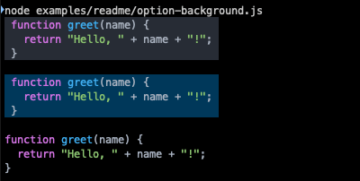
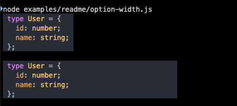
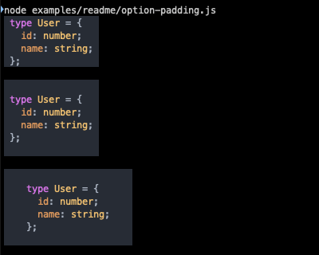

# ansilight

Terminal syntax highlighting with 200+ truecolor themes.

[](docs/theme-screenshots/atom-one-dark.png)

## Features

The key feature is support for all `highlight.js` themes, with visuals very close to the originals.

- Uses `highlight.js` for language highlighting
- Includes 256 truecolor ANSI themes converted from original `highlight.js` CSS themes
- Preserves compound and nested theme selectors like `variable.constant` and `meta keyword`
- Falls back to 256 and 16 colors
- Supports output blocks with background, padding, and fixed/content width

## Install

```sh
npm install ansilight
```

Requires Node.js 18+. This package is ESM only.

> Legacy Node.js 12+ and CommonJS support can be considered if there is sufficient demand.

## Quick Start

Minimal example using the bundled `default` theme.

```js
import ansilight from 'ansilight';

const output = ansilight('const value = "Hello World!";', {
  language: 'javascript',
});

console.log(output);
```

## API

### `ansilight(code, options)`

Highlights source code and returns a string with ANSI escape sequences.

Arguments:

- `code` - source code to highlight
- `options` - highlighting and output options

### Options

| Option           | Type                  | Default                                    | Description                                                       |
|------------------|-----------------------|--------------------------------------------|-------------------------------------------------------------------|
| `language`       | `string`              | auto-detect                                | `highlight.js` option for language name                           |
| `ignoreIllegals` | `boolean`             | `true`                                     | `highlight.js` option for illegal syntax handling                 |
| `theme`          | `object`              | bundled default theme                      | ANSI theme object                                                 |
| `background`     | `string \| false`     | default theme background                   | Background color as a HEX value, or `false` to disable background |
| `padding`        | `number \| string`    | `0`, or `"0 1"` when background is enabled | CSS-like padding shorthand                                        |
| `width`          | `number \| "content"` | `"content"`                                | Visible background width, excluding padding                       |


## Themes

All 256 [`highlight.js` CSS styles](https://github.com/highlightjs/highlight.js/tree/main/src/styles) are converted into ANSI themes as plain JavaScript objects.

The NPM package includes only a small set of popular themes to keep installs lightweight.

### Bundled themes

The NPM package includes:

- `default` (light, built-in)
- `dark` (dark version of `default`)
- `atom-one-light`
- `atom-one-dark`
- `github` (light)
- `github-dark`

```js
import ansilight from 'ansilight';
import theme from 'ansilight/themes/github-dark';

console.log(ansilight(code, { theme }));
```

### Full theme set

The GitHub repository contains all themes in [`themes/`](./themes/).
Copy any theme from this directory into your project and pass it through the `theme` option.

For example, copy [`themes/stackoverflow-light.js`](themes/stackoverflow-light.js) into your project:

```js
import ansilight from 'ansilight';
import theme from './stackoverflow-light.js';

console.log(ansilight(code, { theme }));
```

## Theme gallery

Screenshots are captured in iTerm.

Click a theme name to view its source.\
Click on image to view full size.

| Theme light                                                                                                                                                                | Theme dark                                                                                                                                                                                                                                                 |
|----------------------------------------------------------------------------------------------------------------------------------------------------------------------------|------------------------------------------------------------------------------------------------------------------------------------------------------------------------------------------------------------------------------------------------------------|
| **[default](themes/default.js)**<br>[](docs/theme-screenshots/default.png)                                                   | **[dark](themes/dark.js)**<br>[](docs/theme-screenshots/dark.png)                                                                                                       |
| **[atom-one-light](themes/atom-one-light.js)**<br>[](docs/theme-screenshots/atom-one-light.png)                | **[atom-one-dark](themes/atom-one-dark.js)**<br>[](docs/theme-screenshots/atom-one-dark.png)                                                                                                       |
| **[github](themes/github.js)**<br>[](docs/theme-screenshots/github.png)                                                             | **[github-dark](themes/github-dark.js)**<br>[](docs/theme-screenshots/github-dark.png) |
| **[vs](themes/vs.js)**<br>[](docs/theme-screenshots/vs.png) | **[vs2015](themes/vs2015.js)**<br>[](docs/theme-screenshots/vs2015.png)                                                                                                    |
| **[base16-ia-light](themes/base16-ia-light.js)**<br>[](docs/theme-screenshots/base16-ia-light.png)           | **[base16-ia-dark](themes/base16-ia-dark.js)**<br>[](docs/theme-screenshots/base16-ia-dark.png)                                                                                                    |
| **[stackoverflow-light](themes/stackoverflow-light.js)**<br>[](docs/theme-screenshots/stackoverflow-light.png)                                                             | **[stackoverflow-dark](themes/stackoverflow-dark.js)**<br>[](docs/theme-screenshots/stackoverflow-dark.png) |

See the [full theme gallery](docs/theme-gallery.md) with all 256 themes.


## Examples

### Option `background`

Use `background` to keep the theme background, override it with a custom color, or disable it completely.

```js
import ansilight from 'ansilight';
import theme from 'ansilight/themes/atom-one-dark';

const code =
`function greet(name) {
  return "Hello, " + name + "!";
}`;

console.log(ansilight(code, {
  language: 'javascript',
  // use theme background
  theme,
}), '\n');

console.log(ansilight(code, {
  language: 'javascript',
  background: '#143757', // override theme background
  theme,
}), '\n');

console.log(ansilight(code, {
  language: 'javascript',
  background: false, // disable background
  theme,
}), '\n');
```

[](docs/readme-examples/option-background.png)


### Option `width`

Use `width` to control the visible background width.
The value is a minimum width: if the highlighted code is wider, the block expands to fit the content.

```js
import ansilight from 'ansilight';
import theme from 'ansilight/themes/atom-one-dark';

const code =
`type User = {
  id: number;
  name: string;
};`;

console.log(ansilight(code, {
  language: 'typescript',
  // use content width
  theme,
}), '\n');

console.log(ansilight(code, {
  language: 'typescript',
  width: 40, // set minimum background width
  theme,
}), '\n');
```

[](docs/readme-examples/option-width.png)


### Option `padding`

Use `padding` to add space inside the background block. The value uses CSS-like shorthand: one, two, three, or four numbers.

```js
import ansilight from 'ansilight';
import theme from 'ansilight/themes/atom-one-dark';

const code =
`type User = {
  id: number;
  name: string;
};`;

console.log(ansilight(code, {
  language: 'typescript',
  // default padding
  theme,
}), '\n');

console.log(ansilight(code, {
  language: 'typescript',
  padding: 1, // same padding on all sides
  theme,
}), '\n');

console.log(ansilight(code, {
  language: 'typescript',
  padding: '1 4', // vertical and horizontal padding
  theme,
}), '\n');
```

[](docs/readme-examples/option-padding.png)


## Changelog

See [CHANGELOG.md](./CHANGELOG.md).

## License

[ISC](https://github.com/webdiscus/ansilight/blob/master/LICENSE)
