# Theme Gallery

256 ANSI truecolor themes converted from original [highlight.js CSS styles](https://github.com/highlightjs/highlight.js/tree/main/src/styles)
([examples](https://highlightjs.org/examples)).

Screenshots captured from iTerm.

| Theme | Theme |
| --- | --- |
| **[1c-light](../themes/1c-light.js)** [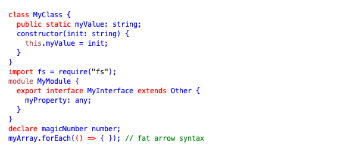](theme-screenshots/1c-light.png) | **[a11y-dark](../themes/a11y-dark.js)** [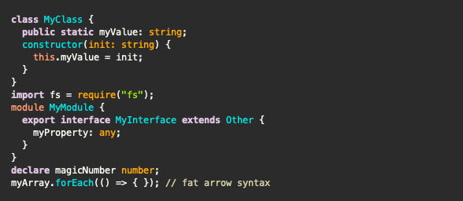](theme-screenshots/a11y-dark.png) |
| **[a11y-light](../themes/a11y-light.js)** [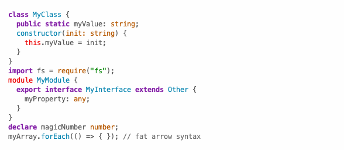](theme-screenshots/a11y-light.png) | **[agate](../themes/agate.js)** [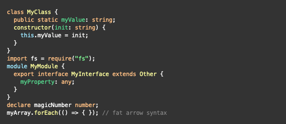](theme-screenshots/agate.png) |
| **[an-old-hope](../themes/an-old-hope.js)** [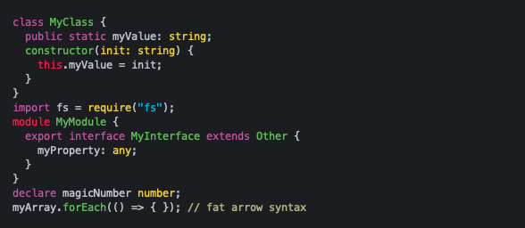](theme-screenshots/an-old-hope.png) | **[androidstudio](../themes/androidstudio.js)** [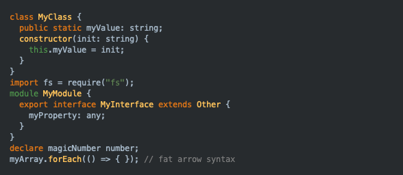](theme-screenshots/androidstudio.png) |
| **[arduino-light](../themes/arduino-light.js)** [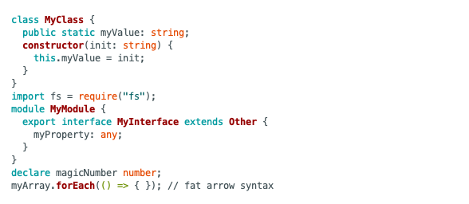](theme-screenshots/arduino-light.png) | **[arta](../themes/arta.js)** [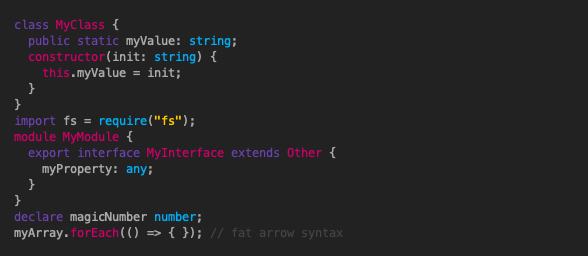](theme-screenshots/arta.png) |
| **[ascetic](../themes/ascetic.js)** [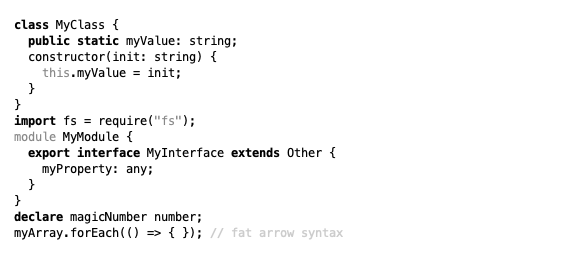](theme-screenshots/ascetic.png) | **[atom-one-dark](../themes/atom-one-dark.js)** [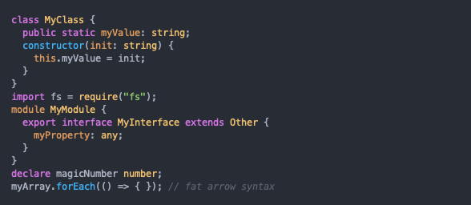](theme-screenshots/atom-one-dark.png) |
| **[atom-one-dark-reasonable](../themes/atom-one-dark-reasonable.js)** [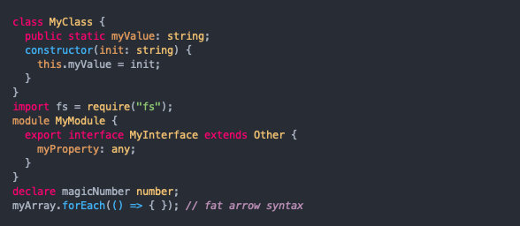](theme-screenshots/atom-one-dark-reasonable.png) | **[atom-one-light](../themes/atom-one-light.js)** [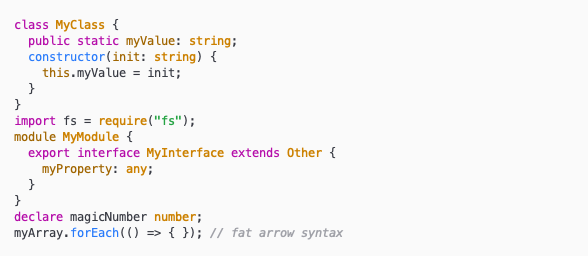](theme-screenshots/atom-one-light.png) |
| **[base16-3024](../themes/base16-3024.js)** [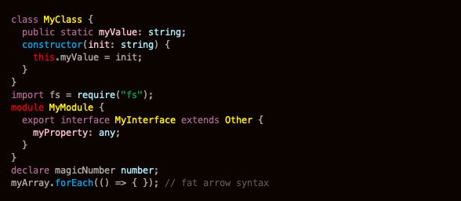](theme-screenshots/base16-3024.png) | **[base16-apathy](../themes/base16-apathy.js)** [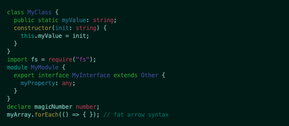](theme-screenshots/base16-apathy.png) |
| **[base16-apprentice](../themes/base16-apprentice.js)** [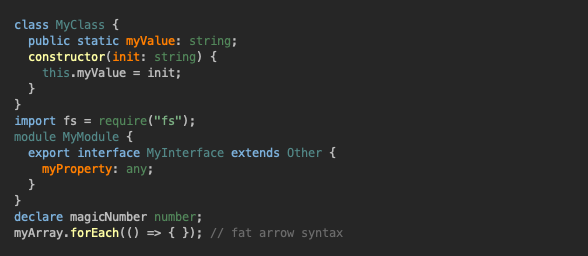](theme-screenshots/base16-apprentice.png) | **[base16-ashes](../themes/base16-ashes.js)** [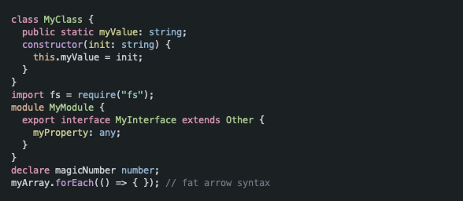](theme-screenshots/base16-ashes.png) |
| **[base16-atelier-cave](../themes/base16-atelier-cave.js)** [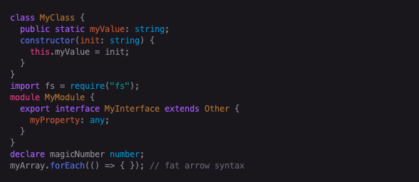](theme-screenshots/base16-atelier-cave.png) | **[base16-atelier-cave-light](../themes/base16-atelier-cave-light.js)** [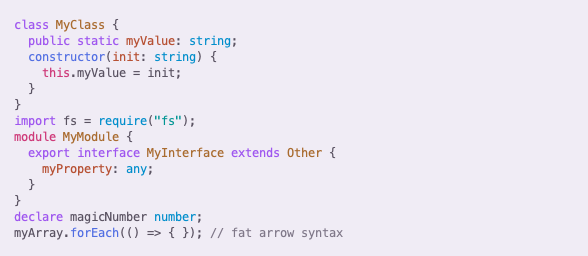](theme-screenshots/base16-atelier-cave-light.png) |
| **[base16-atelier-dune](../themes/base16-atelier-dune.js)** [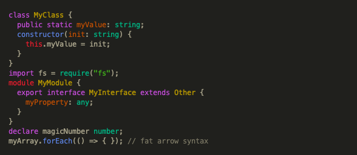](theme-screenshots/base16-atelier-dune.png) | **[base16-atelier-dune-light](../themes/base16-atelier-dune-light.js)** [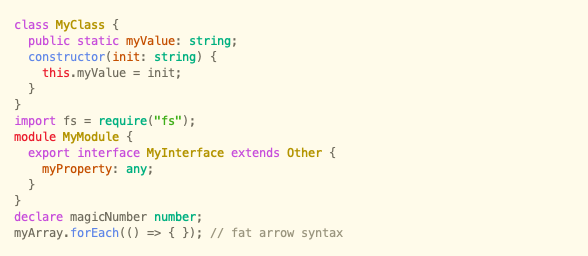](theme-screenshots/base16-atelier-dune-light.png) |
| **[base16-atelier-estuary](../themes/base16-atelier-estuary.js)** [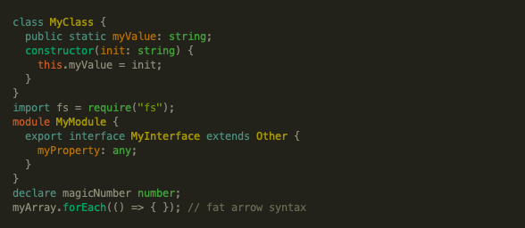](theme-screenshots/base16-atelier-estuary.png) | **[base16-atelier-estuary-light](../themes/base16-atelier-estuary-light.js)** [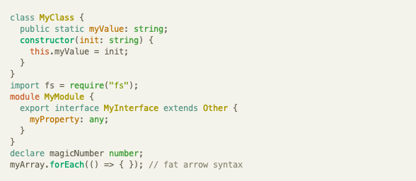](theme-screenshots/base16-atelier-estuary-light.png) |
| **[base16-atelier-forest](../themes/base16-atelier-forest.js)** [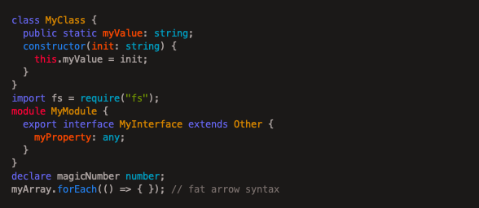](theme-screenshots/base16-atelier-forest.png) | **[base16-atelier-forest-light](../themes/base16-atelier-forest-light.js)** [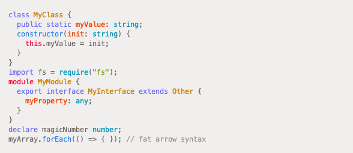](theme-screenshots/base16-atelier-forest-light.png) |
| **[base16-atelier-heath](../themes/base16-atelier-heath.js)** [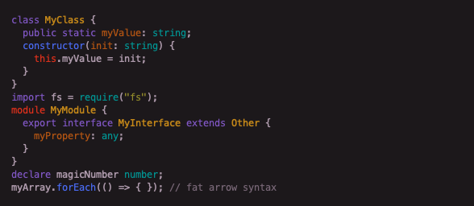](theme-screenshots/base16-atelier-heath.png) | **[base16-atelier-heath-light](../themes/base16-atelier-heath-light.js)** [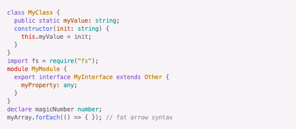](theme-screenshots/base16-atelier-heath-light.png) |
| **[base16-atelier-lakeside](../themes/base16-atelier-lakeside.js)** [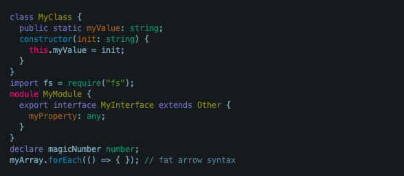](theme-screenshots/base16-atelier-lakeside.png) | **[base16-atelier-lakeside-light](../themes/base16-atelier-lakeside-light.js)** [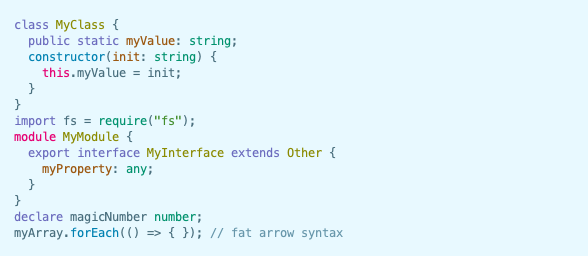](theme-screenshots/base16-atelier-lakeside-light.png) |
| **[base16-atelier-plateau](../themes/base16-atelier-plateau.js)** [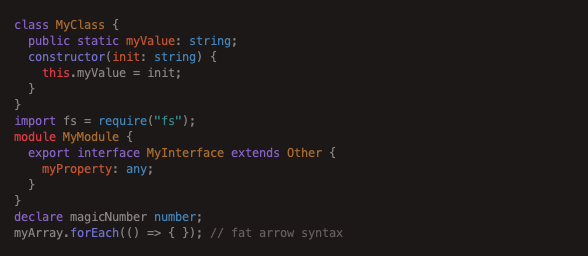](theme-screenshots/base16-atelier-plateau.png) | **[base16-atelier-plateau-light](../themes/base16-atelier-plateau-light.js)** [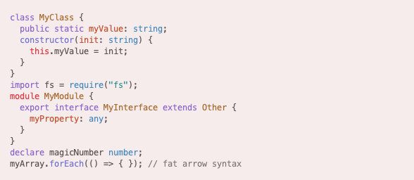](theme-screenshots/base16-atelier-plateau-light.png) |
| **[base16-atelier-savanna](../themes/base16-atelier-savanna.js)** [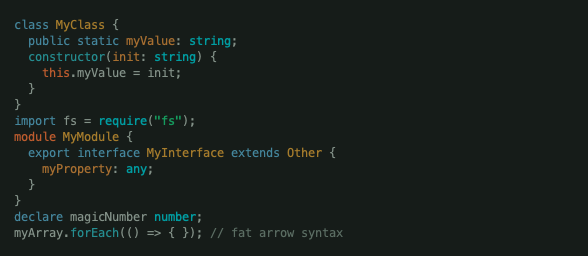](theme-screenshots/base16-atelier-savanna.png) | **[base16-atelier-savanna-light](../themes/base16-atelier-savanna-light.js)** [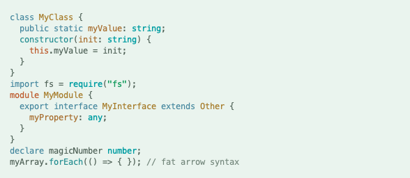](theme-screenshots/base16-atelier-savanna-light.png) |
| **[base16-atelier-seaside](../themes/base16-atelier-seaside.js)** [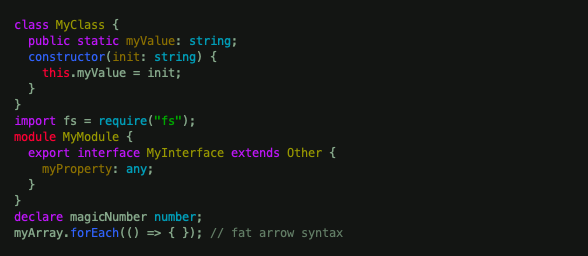](theme-screenshots/base16-atelier-seaside.png) | **[base16-atelier-seaside-light](../themes/base16-atelier-seaside-light.js)** [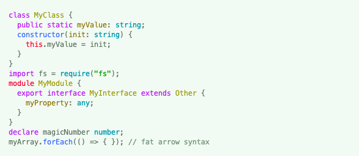](theme-screenshots/base16-atelier-seaside-light.png) |
| **[base16-atelier-sulphurpool](../themes/base16-atelier-sulphurpool.js)** [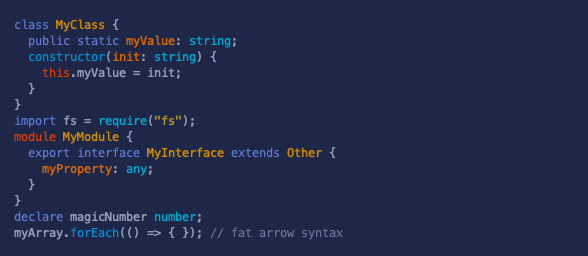](theme-screenshots/base16-atelier-sulphurpool.png) | **[base16-atelier-sulphurpool-light](../themes/base16-atelier-sulphurpool-light.js)** [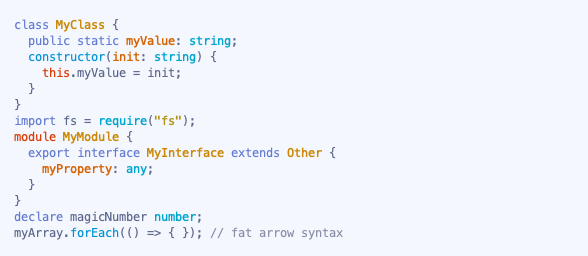](theme-screenshots/base16-atelier-sulphurpool-light.png) |
| **[base16-atlas](../themes/base16-atlas.js)** [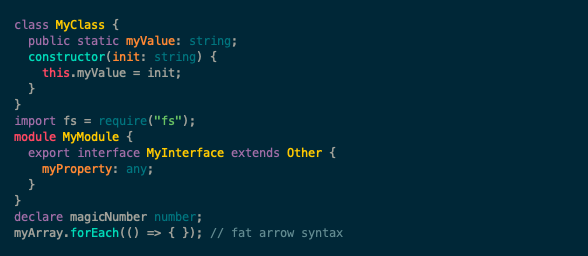](theme-screenshots/base16-atlas.png) | **[base16-bespin](../themes/base16-bespin.js)** [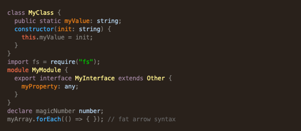](theme-screenshots/base16-bespin.png) |
| **[base16-black-metal](../themes/base16-black-metal.js)** [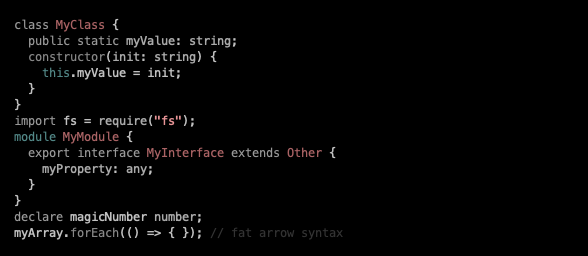](theme-screenshots/base16-black-metal.png) | **[base16-black-metal-bathory](../themes/base16-black-metal-bathory.js)** [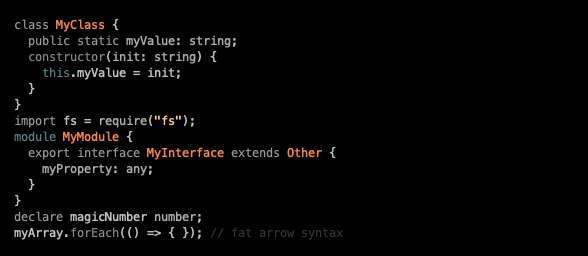](theme-screenshots/base16-black-metal-bathory.png) |
| **[base16-black-metal-burzum](../themes/base16-black-metal-burzum.js)** [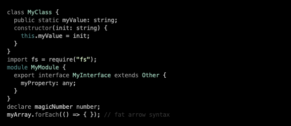](theme-screenshots/base16-black-metal-burzum.png) | **[base16-black-metal-dark-funeral](../themes/base16-black-metal-dark-funeral.js)** [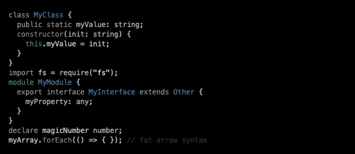](theme-screenshots/base16-black-metal-dark-funeral.png) |
| **[base16-black-metal-gorgoroth](../themes/base16-black-metal-gorgoroth.js)** [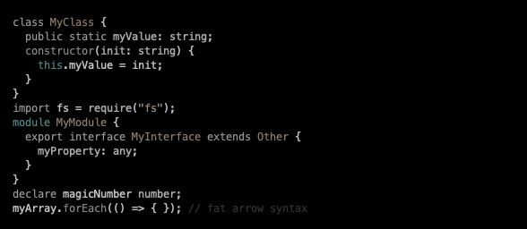](theme-screenshots/base16-black-metal-gorgoroth.png) | **[base16-black-metal-immortal](../themes/base16-black-metal-immortal.js)** [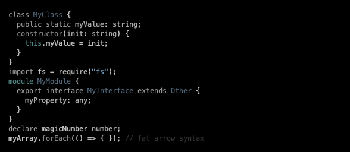](theme-screenshots/base16-black-metal-immortal.png) |
| **[base16-black-metal-khold](../themes/base16-black-metal-khold.js)** [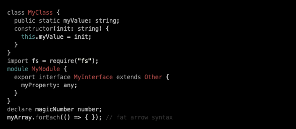](theme-screenshots/base16-black-metal-khold.png) | **[base16-black-metal-marduk](../themes/base16-black-metal-marduk.js)** [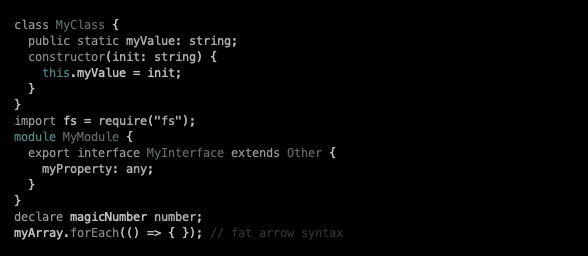](theme-screenshots/base16-black-metal-marduk.png) |
| **[base16-black-metal-mayhem](../themes/base16-black-metal-mayhem.js)** [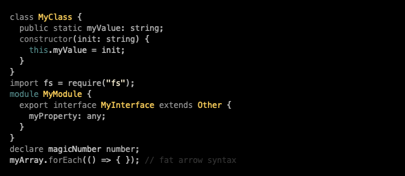](theme-screenshots/base16-black-metal-mayhem.png) | **[base16-black-metal-nile](../themes/base16-black-metal-nile.js)** [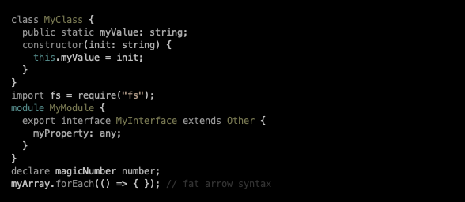](theme-screenshots/base16-black-metal-nile.png) |
| **[base16-black-metal-venom](../themes/base16-black-metal-venom.js)** [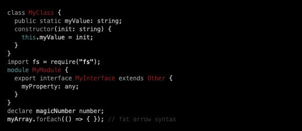](theme-screenshots/base16-black-metal-venom.png) | **[base16-brewer](../themes/base16-brewer.js)** [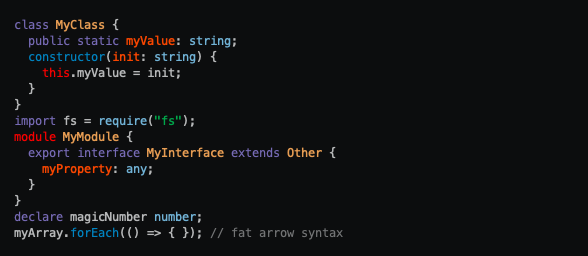](theme-screenshots/base16-brewer.png) |
| **[base16-bright](../themes/base16-bright.js)**  | **[base16-brogrammer](../themes/base16-brogrammer.js)**  |
| **[base16-brush-trees](../themes/base16-brush-trees.js)**  | **[base16-brush-trees-dark](../themes/base16-brush-trees-dark.js)**  |
| **[base16-chalk](../themes/base16-chalk.js)**  | **[base16-circus](../themes/base16-circus.js)**  |
| **[base16-classic-dark](../themes/base16-classic-dark.js)**  | **[base16-classic-light](../themes/base16-classic-light.js)**  |
| **[base16-codeschool](../themes/base16-codeschool.js)**  | **[base16-colors](../themes/base16-colors.js)**  |
| **[base16-cupcake](../themes/base16-cupcake.js)**  | **[base16-cupertino](../themes/base16-cupertino.js)**  |
| **[base16-danqing](../themes/base16-danqing.js)**  | **[base16-darcula](../themes/base16-darcula.js)**  |
| **[base16-dark-violet](../themes/base16-dark-violet.js)**  | **[base16-darkmoss](../themes/base16-darkmoss.js)**  |
| **[base16-darktooth](../themes/base16-darktooth.js)**  | **[base16-decaf](../themes/base16-decaf.js)**  |
| **[base16-default-dark](../themes/base16-default-dark.js)**  | **[base16-default-light](../themes/base16-default-light.js)**  |
| **[base16-dirtysea](../themes/base16-dirtysea.js)**  | **[base16-dracula](../themes/base16-dracula.js)**  |
| **[base16-edge-dark](../themes/base16-edge-dark.js)**  | **[base16-edge-light](../themes/base16-edge-light.js)**  |
| **[base16-eighties](../themes/base16-eighties.js)**  | **[base16-embers](../themes/base16-embers.js)**  |
| **[base16-equilibrium-dark](../themes/base16-equilibrium-dark.js)**  | **[base16-equilibrium-gray-dark](../themes/base16-equilibrium-gray-dark.js)**  |
| **[base16-equilibrium-gray-light](../themes/base16-equilibrium-gray-light.js)**  | **[base16-equilibrium-light](../themes/base16-equilibrium-light.js)**  |
| **[base16-espresso](../themes/base16-espresso.js)**  | **[base16-eva](../themes/base16-eva.js)**  |
| **[base16-eva-dim](../themes/base16-eva-dim.js)**  | **[base16-flat](../themes/base16-flat.js)**  |
| **[base16-framer](../themes/base16-framer.js)**  | **[base16-fruit-soda](../themes/base16-fruit-soda.js)**  |
| **[base16-gigavolt](../themes/base16-gigavolt.js)**  | **[base16-github](../themes/base16-github.js)**  |
| **[base16-google-dark](../themes/base16-google-dark.js)**  | **[base16-google-light](../themes/base16-google-light.js)**  |
| **[base16-grayscale-dark](../themes/base16-grayscale-dark.js)**  | **[base16-grayscale-light](../themes/base16-grayscale-light.js)**  |
| **[base16-green-screen](../themes/base16-green-screen.js)**  | **[base16-gruvbox-dark-hard](../themes/base16-gruvbox-dark-hard.js)**  |
| **[base16-gruvbox-dark-medium](../themes/base16-gruvbox-dark-medium.js)**  | **[base16-gruvbox-dark-pale](../themes/base16-gruvbox-dark-pale.js)**  |
| **[base16-gruvbox-dark-soft](../themes/base16-gruvbox-dark-soft.js)**  | **[base16-gruvbox-light-hard](../themes/base16-gruvbox-light-hard.js)**  |
| **[base16-gruvbox-light-medium](../themes/base16-gruvbox-light-medium.js)**  | **[base16-gruvbox-light-soft](../themes/base16-gruvbox-light-soft.js)**  |
| **[base16-hardcore](../themes/base16-hardcore.js)**  | **[base16-harmonic16-dark](../themes/base16-harmonic16-dark.js)**  |
| **[base16-harmonic16-light](../themes/base16-harmonic16-light.js)**  | **[base16-heetch-dark](../themes/base16-heetch-dark.js)**  |
| **[base16-heetch-light](../themes/base16-heetch-light.js)**  | **[base16-helios](../themes/base16-helios.js)**  |
| **[base16-hopscotch](../themes/base16-hopscotch.js)**  | **[base16-horizon-dark](../themes/base16-horizon-dark.js)**  |
| **[base16-horizon-light](../themes/base16-horizon-light.js)**  | **[base16-humanoid-dark](../themes/base16-humanoid-dark.js)**  |
| **[base16-humanoid-light](../themes/base16-humanoid-light.js)**  | **[base16-ia-dark](../themes/base16-ia-dark.js)**  |
| **[base16-ia-light](../themes/base16-ia-light.js)**  | **[base16-icy-dark](../themes/base16-icy-dark.js)**  |
| **[base16-ir-black](../themes/base16-ir-black.js)**  | **[base16-isotope](../themes/base16-isotope.js)**  |
| **[base16-kimber](../themes/base16-kimber.js)**  | **[base16-london-tube](../themes/base16-london-tube.js)**  |
| **[base16-macintosh](../themes/base16-macintosh.js)**  | **[base16-marrakesh](../themes/base16-marrakesh.js)**  |
| **[base16-materia](../themes/base16-materia.js)**  | **[base16-material](../themes/base16-material.js)**  |
| **[base16-material-darker](../themes/base16-material-darker.js)**  | **[base16-material-lighter](../themes/base16-material-lighter.js)**  |
| **[base16-material-palenight](../themes/base16-material-palenight.js)**  | **[base16-material-vivid](../themes/base16-material-vivid.js)**  |
| **[base16-mellow-purple](../themes/base16-mellow-purple.js)**  | **[base16-mexico-light](../themes/base16-mexico-light.js)**  |
| **[base16-mocha](../themes/base16-mocha.js)**  | **[base16-monokai](../themes/base16-monokai.js)**  |
| **[base16-nebula](../themes/base16-nebula.js)**  | **[base16-nord](../themes/base16-nord.js)**  |
| **[base16-nova](../themes/base16-nova.js)**  | **[base16-ocean](../themes/base16-ocean.js)**  |
| **[base16-oceanicnext](../themes/base16-oceanicnext.js)**  | **[base16-one-light](../themes/base16-one-light.js)**  |
| **[base16-onedark](../themes/base16-onedark.js)**  | **[base16-outrun-dark](../themes/base16-outrun-dark.js)**  |
| **[base16-papercolor-dark](../themes/base16-papercolor-dark.js)**  | **[base16-papercolor-light](../themes/base16-papercolor-light.js)**  |
| **[base16-paraiso](../themes/base16-paraiso.js)**  | **[base16-pasque](../themes/base16-pasque.js)**  |
| **[base16-phd](../themes/base16-phd.js)**  | **[base16-pico](../themes/base16-pico.js)**  |
| **[base16-pop](../themes/base16-pop.js)**  | **[base16-porple](../themes/base16-porple.js)**  |
| **[base16-qualia](../themes/base16-qualia.js)**  | **[base16-railscasts](../themes/base16-railscasts.js)**  |
| **[base16-rebecca](../themes/base16-rebecca.js)**  | **[base16-ros-pine](../themes/base16-ros-pine.js)**  |
| **[base16-ros-pine-dawn](../themes/base16-ros-pine-dawn.js)**  | **[base16-ros-pine-moon](../themes/base16-ros-pine-moon.js)**  |
| **[base16-sagelight](../themes/base16-sagelight.js)**  | **[base16-sandcastle](../themes/base16-sandcastle.js)**  |
| **[base16-seti-ui](../themes/base16-seti-ui.js)**  | **[base16-shapeshifter](../themes/base16-shapeshifter.js)**  |
| **[base16-silk-dark](../themes/base16-silk-dark.js)**  | **[base16-silk-light](../themes/base16-silk-light.js)**  |
| **[base16-snazzy](../themes/base16-snazzy.js)**  | **[base16-solar-flare](../themes/base16-solar-flare.js)**  |
| **[base16-solar-flare-light](../themes/base16-solar-flare-light.js)**  | **[base16-solarized-dark](../themes/base16-solarized-dark.js)**  |
| **[base16-solarized-light](../themes/base16-solarized-light.js)**  | **[base16-spacemacs](../themes/base16-spacemacs.js)**  |
| **[base16-summercamp](../themes/base16-summercamp.js)**  | **[base16-summerfruit-dark](../themes/base16-summerfruit-dark.js)**  |
| **[base16-summerfruit-light](../themes/base16-summerfruit-light.js)**  | **[base16-synth-midnight-terminal-dark](../themes/base16-synth-midnight-terminal-dark.js)**  |
| **[base16-synth-midnight-terminal-light](../themes/base16-synth-midnight-terminal-light.js)**  | **[base16-tango](../themes/base16-tango.js)**  |
| **[base16-tender](../themes/base16-tender.js)**  | **[base16-tomorrow](../themes/base16-tomorrow.js)**  |
| **[base16-tomorrow-night](../themes/base16-tomorrow-night.js)**  | **[base16-twilight](../themes/base16-twilight.js)**  |
| **[base16-unikitty-dark](../themes/base16-unikitty-dark.js)**  | **[base16-unikitty-light](../themes/base16-unikitty-light.js)**  |
| **[base16-vulcan](../themes/base16-vulcan.js)**  | **[base16-windows-10](../themes/base16-windows-10.js)**  |
| **[base16-windows-10-light](../themes/base16-windows-10-light.js)**  | **[base16-windows-95](../themes/base16-windows-95.js)**  |
| **[base16-windows-95-light](../themes/base16-windows-95-light.js)**  | **[base16-windows-high-contrast](../themes/base16-windows-high-contrast.js)**  |
| **[base16-windows-high-contrast-light](../themes/base16-windows-high-contrast-light.js)**  | **[base16-windows-nt](../themes/base16-windows-nt.js)**  |
| **[base16-windows-nt-light](../themes/base16-windows-nt-light.js)**  | **[base16-woodland](../themes/base16-woodland.js)**  |
| **[base16-xcode-dusk](../themes/base16-xcode-dusk.js)**  | **[base16-zenburn](../themes/base16-zenburn.js)**  |
| **[brown-paper](../themes/brown-paper.js)**  | **[codepen-embed](../themes/codepen-embed.js)**  |
| **[color-brewer](../themes/color-brewer.js)**  | **[cybertopia-cherry](../themes/cybertopia-cherry.js)**  |
| **[cybertopia-dimmer](../themes/cybertopia-dimmer.js)**  | **[cybertopia-icecap](../themes/cybertopia-icecap.js)**  |
| **[cybertopia-saturated](../themes/cybertopia-saturated.js)**  | **[dark](../themes/dark.js)**  |
| **[default](../themes/default.js)**  | **[devibeans](../themes/devibeans.js)**  |
| **[docco](../themes/docco.js)**  | **[far](../themes/far.js)**  |
| **[felipec](../themes/felipec.js)**  | **[foundation](../themes/foundation.js)**  |
| **[github](../themes/github.js)**  | **[github-dark](../themes/github-dark.js)**  |
| **[github-dark-dimmed](../themes/github-dark-dimmed.js)**  | **[gml](../themes/gml.js)**  |
| **[googlecode](../themes/googlecode.js)**  | **[gradient-dark](../themes/gradient-dark.js)**  |
| **[gradient-light](../themes/gradient-light.js)**  | **[grayscale](../themes/grayscale.js)**  |
| **[hybrid](../themes/hybrid.js)**  | **[idea](../themes/idea.js)**  |
| **[intellij-light](../themes/intellij-light.js)**  | **[ir-black](../themes/ir-black.js)**  |
| **[isbl-editor-dark](../themes/isbl-editor-dark.js)**  | **[isbl-editor-light](../themes/isbl-editor-light.js)**  |
| **[kimbie-dark](../themes/kimbie-dark.js)**  | **[kimbie-light](../themes/kimbie-light.js)**  |
| **[lightfair](../themes/lightfair.js)**  | **[lioshi](../themes/lioshi.js)**  |
| **[magula](../themes/magula.js)**  | **[mono-blue](../themes/mono-blue.js)**  |
| **[monokai](../themes/monokai.js)**  | **[monokai-sublime](../themes/monokai-sublime.js)**  |
| **[night-owl](../themes/night-owl.js)**  | **[nnfx-dark](../themes/nnfx-dark.js)**  |
| **[nnfx-light](../themes/nnfx-light.js)**  | **[nord](../themes/nord.js)**  |
| **[obsidian](../themes/obsidian.js)**  | **[panda-syntax-dark](../themes/panda-syntax-dark.js)**  |
| **[panda-syntax-light](../themes/panda-syntax-light.js)**  | **[paraiso-dark](../themes/paraiso-dark.js)**  |
| **[paraiso-light](../themes/paraiso-light.js)**  | **[pojoaque](../themes/pojoaque.js)**  |
| **[purebasic](../themes/purebasic.js)**  | **[qtcreator-dark](../themes/qtcreator-dark.js)**  |
| **[qtcreator-light](../themes/qtcreator-light.js)**  | **[rainbow](../themes/rainbow.js)**  |
| **[rose-pine](../themes/rose-pine.js)**  | **[rose-pine-dawn](../themes/rose-pine-dawn.js)**  |
| **[rose-pine-moon](../themes/rose-pine-moon.js)**  | **[routeros](../themes/routeros.js)**  |
| **[school-book](../themes/school-book.js)**  | **[shades-of-purple](../themes/shades-of-purple.js)**  |
| **[srcery](../themes/srcery.js)**  | **[stackoverflow-dark](../themes/stackoverflow-dark.js)**  |
| **[stackoverflow-light](../themes/stackoverflow-light.js)**  | **[sunburst](../themes/sunburst.js)**  |
| **[tokyo-night-dark](../themes/tokyo-night-dark.js)**  | **[tokyo-night-light](../themes/tokyo-night-light.js)**  |
| **[tomorrow-night-blue](../themes/tomorrow-night-blue.js)**  | **[tomorrow-night-bright](../themes/tomorrow-night-bright.js)**  |
| **[vs](../themes/vs.js)**  | **[vs2015](../themes/vs2015.js)**  |
| **[xcode](../themes/xcode.js)**  | **[xt256](../themes/xt256.js)**  |
